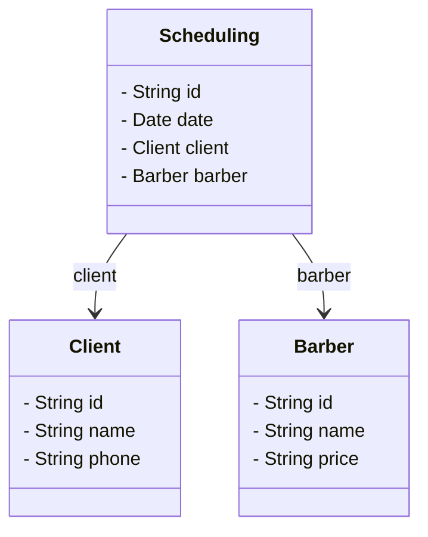

# Desafio Dio - Santander Open Acdemy 2024 - Java para Backend

## Diagrama de classes

```mermaid
classDiagram
    class Scheduling {
        - String id
        - Date date
        - Client client
        - Barber barber
    }

    class Client {
        - String id
        - String name
        - String phone
    }

    class Barber {
        - String id
        - String name
        - String price
    }

    Scheduling --> Client : client
    Scheduling --> Barber : barber
```
